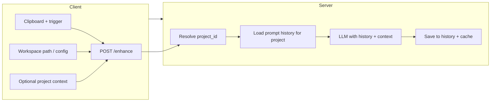

# Project-Scoped Memory and Optional RAG for PromptBoost

## Current behavior (why there's no memory)

- **Client** ([enhancer_client/enhancer/api_client.py](../enhancer_client/enhancer/api_client.py)) sends only: `original_prompt`, `user_id`, `session_id`, `is_reroll`, `true_original_prompt`. No project or workspace, no history.
- **Server** ([server/app/services/llm_service.py](../server/app/services/llm_service.py)) enhances using only the current `user_prompt` + a heuristic `persona`. Reroll adds `previous_enhancement` for that single request only.
- **State** ([enhancer_client/enhancer/state.py](../enhancer_client/enhancer/state.py)) keeps only in-memory `_last_original_prompt` / `_last_enhanced_prompt` for reroll detection—no persistence, no per-project.
- **DB** ([server/app/models/prompt.py](../server/app/models/prompt.py)): `prompt_cache` is global (unique on `original_prompt`). `usage_analytics` has `user_id`/`session_id` but no project, so you can't "last N prompts for this project."

So every enhancement is stateless: no project, no prior prompts.

---

## Goal

1. **Project identity** – Each enhancement is tied to a "project" (e.g. workspace folder) so we can scope history and optional RAG.
2. **Prompt history** – Store and retrieve recent prompts (and enhancements) per project so the LLM can maintain continuity ("your previous prompt was …").
3. **Project context (optional)** – Use project-specific context (e.g. README, stack, key files) so enhancements fit the codebase.
4. **Scalable** – Support many projects without manual tracking; project id is derived from something the client already has (e.g. workspace path).
5. **RAG (optional)** – Use retrieval over project content to make enhancements even more context-aware.

---

## Architecture (high level)

- Client sends **project identifier** (and optionally **project context**).
- Server resolves `project_id`, loads **recent prompt history** for that project, and passes **history + project context** into the LLM.
- Results are stored in a **project-scoped** way so the next request for the same project has memory.

---

## Phase 1: Project identity + prompt history (no RAG)

This gives you "memory" of previous prompts per project and is the foundation.

### 1.1 Project identifier

- **Client**: Send an optional `workspace_path` (or `project_id`) with each enhance request.
  - **Source of truth**: Prefer a single, explicit source so "tracking every project" is automatic:
    - **Option A (recommended)**: Env var `PROMPTBOOST_WORKSPACE` (e.g. set by the user or by a small launcher/script when working in a project).
    - **Option B**: Store in [enhancer_client/enhancer/config.py](../enhancer_client/enhancer/config.py) / `user_config.json` a "current workspace" that the user (or a future IDE integration) can set.
  - Normalize path (e.g. resolve, lowercase on Windows) and derive a stable **project_id** (e.g. SHA256 hash of normalized path) so the server doesn't store raw paths. Client can send either:
    - `workspace_path` (server hashes it to `project_id`), or
    - `project_id` (client hashes and sends only the id).
- **Server**: Accept optional `workspace_path` or `project_id` in the enhance API. Resolve to a single `project_id` (string or UUID) and pass it through the graph.

### 1.2 Schema and API

- **Request** ([server/app/schemas/prompt.py](../server/app/schemas/prompt.py)): Add optional `workspace_path: str | None` and/or `project_id: str | None` to `PromptEnhanceRequest`. If both are sent, prefer `project_id`; else compute `project_id` from `workspace_path` on the server.
- **Enhance endpoint** ([server/app/api/v1/enhance.py](../server/app/api/v1/enhance.py)): Compute `project_id` (from request or hash of `workspace_path`), add it to `inputs` for the graph.

### 1.3 Persist history per project

- **New table (recommended)**: `prompt_history` with columns such as: `id`, `project_id`, `user_id`, `original_prompt`, `enhanced_prompt`, `session_id`, `created_at`. This is the "memory" for the project.
  - **Alternative**: Add `project_id` to existing `usage_analytics` and optionally to `prompt_cache`, and treat "recent rows for (project_id, user_id)" as history. That reuses tables but mixes "analytics" with "history"; a dedicated table is clearer.
- **Cache behavior**: Today [prompt_cache](../server/app/models/prompt.py) is global (unique `original_prompt`). For project-aware behavior, either:
  - Add `project_id` to `prompt_cache` and make the natural key `(project_id, original_prompt)`, and look up cache by `(project_id, original_prompt)`, or
  - Keep cache global and only use `prompt_history` for "recent prompts" context; cache remains a global dedup if you want. Recommendation: add `project_id` to cache so the same prompt in different projects can have different enhancements.
- **CRUD**: Create `prompt_history` CRUD: insert on each enhancement; function `get_recent_prompts_for_project(db, project_id, user_id, limit=5)` (or by `project_id` only) ordered by `created_at desc`.

### 1.4 Graph and LLM

- **GraphState** ([server/app/graphs/enhance_graph.py](../server/app/graphs/enhance_graph.py)): Add `project_id: str | None` and `recent_prompts: list[dict] | None` (or a simple list of strings).
- **Graph**:
  - After resolving `project_id`, if present: load `recent_prompts` (e.g. last 5 `(original, enhanced)` or last 5 originals) from `prompt_history` and put into state.
  - In `save_results`, write the new pair to `prompt_history` (and optionally to `prompt_cache` keyed by `project_id` + `original_prompt`).
- **LLM** ([server/app/services/llm_service.py](../server/app/services/llm_service.py)): Extend `get_enhanced_prompt(user_prompt, ...)` with optional `recent_prompts: list[tuple[str, str]] | None` (and later `project_context: str | None`). Add a short block in the system/task prompt, e.g. "Recent prompts in this project (for continuity): …" so the model can preserve context and avoid repeating or contradicting prior prompts.

### 1.5 Client

- **Config** ([enhancer_client/enhancer/config.py](../enhancer_client/enhancer/config.py)): Add `WORKSPACE_PATH: str | None` (from env or `user_config.json`). Optionally compute and store `project_id` (hash) locally so the client can send only `project_id`.
- **API client** ([enhancer_client/enhancer/api_client.py](../enhancer_client/enhancer/api_client.py)): Include `workspace_path` or `project_id` in the enhance payload when available.
- **Main flow** ([enhancer_client/main.py](../enhancer_client/main.py)): When calling `enhance_prompt_from_api`, pass the workspace/project id. No need to change trigger or clipboard logic.

Result: For each project you have a stable id and the last N prompts stored; the LLM sees "previous prompts in this project" and can enhance with continuity.

---

## Phase 2: Project context (no vector DB yet)

So the enhancer knows *what* the project is (stack, purpose, key files), not just prior prompts.

- **Client**: Optionally gather a small "project context" string, e.g.:
  - Contents of `README.md` (or first N chars), and/or
  - `package.json` / `requirements.txt` / `pyproject.toml` (or just file names and a one-line description).
  - Either the client sends this in the same request as a single text field, or you add a separate "refresh project context" flow that stores it on the server keyed by `project_id`.
- **Server**: Accept optional `project_context: str | None` in the enhance request (or from a stored blob by `project_id`). Pass it into `get_enhanced_prompt` and add a section in the prompt, e.g. "Project context (use for consistency): …".
- **LLM**: Extend the enhancement template with an optional `<project_context>` block so the model can tailor the enhanced prompt to the stack and goals of the project.

This keeps implementation simple (no embeddings, no vector DB) while giving the model project awareness.

---

## Phase 3: RAG — Decision: Option A (Client-sent context)

**Chosen approach: Option A (Client-sent context)** for production.

### Option A: Client-sent context (implemented)

- Client does lightweight "retrieval" locally: e.g. README (first N chars), `package.json` / `requirements.txt` / `pyproject.toml`, and optionally snippets from files matching the current prompt or from a "recent files" list. Send these as a single `project_context` string (or structured snippets) with the enhance request.
- Server receives optional `project_context` and passes it into the LLM. No vector DB or embeddings on the server.
- **Implemented** in [enhancer_client/enhancer/project_context.py](../enhancer_client/enhancer/project_context.py).

### Option B: Server-side vector RAG (deferred)

- **Sync step**: Client sends `project_id` and a set of **chunks** (e.g. file path + content snippet). Server stores them in a vector store (e.g. Chroma, or pgvector in Postgres) keyed by `project_id`.
- **Enhance step**: On `/enhance`, server retrieves top-K chunks for the current `original_prompt` (embed prompt, query by `project_id`), then passes retrieved text as `project_context` into the LLM.
- Revisit if you need semantic retrieval over very large codebases and can operate vector DB + embedding pipeline.

---

## Summary of changes (Phase 1 + 2)

| Layer             | Change                                                                                                        |
| ----------------- | ------------------------------------------------------------------------------------------------------------- |
| **Client config** | Add workspace path (env or user_config); optional project_context gathering.                                  |
| **Client API**    | Send `workspace_path` or `project_id` and optional `project_context` in enhance request.                      |
| **Server schema** | Optional `workspace_path`, `project_id`, `project_context` on request.                                        |
| **Server DB**     | New `prompt_history` table; optionally add `project_id` to `prompt_cache`.                                    |
| **Server graph**  | Resolve `project_id`, load recent prompts from history, pass to LLM; save new pair to history (and cache).   |
| **LLM service**   | New optional args: `recent_prompts`, `project_context`; extend prompt template with history + context blocks. |

This gives you project-scoped memory and project context. RAG can then be added on top (client-sent snippets or server-side vector retrieval) without changing the core flow.
